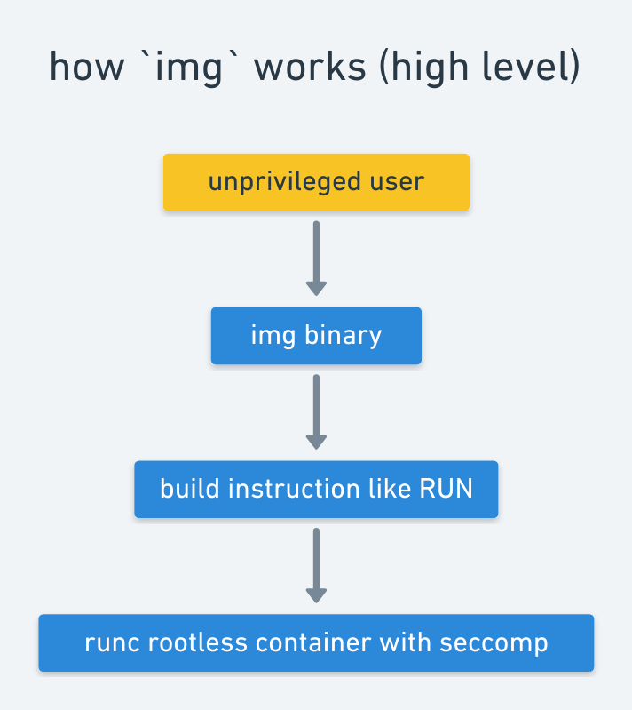
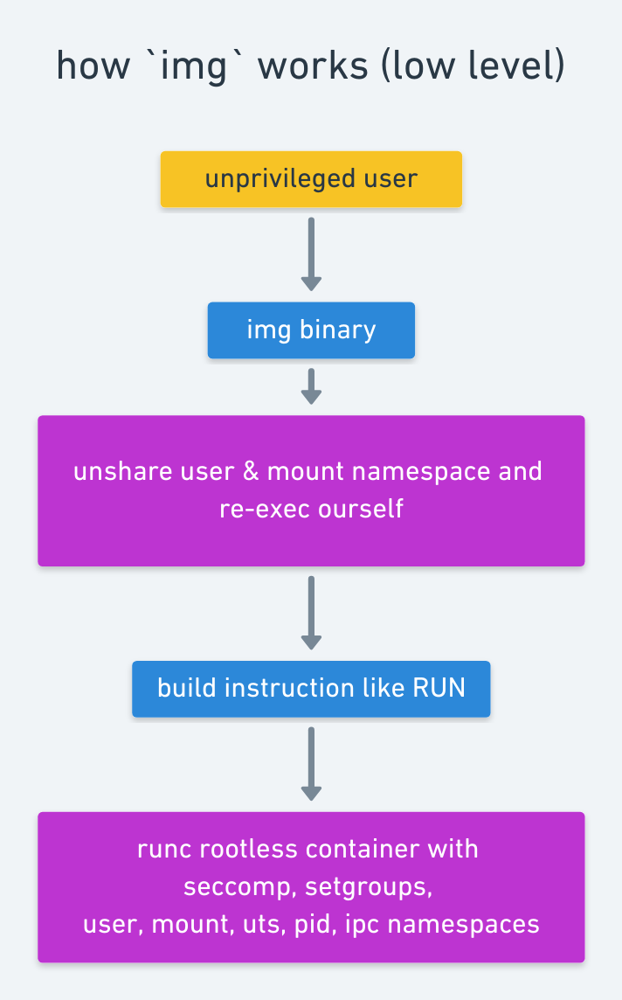

# img

[](https://travis-ci.org/genuinetools/img)

Standalone, daemon-less, unprivileged Dockerfile and OCI compatible
container image builder.

`img` is more cache-efficient than Docker and can also execute multiple build stages concurrently, 
as it internally uses [BuildKit](https://github.com/moby/buildkit)'s DAG solver.

The commands/UX are the same as `docker {build,push,pull,login}` so all you 
have to do is replace `docker` with `img` in your scripts, command line, and/or life.

## Goals

This a glorified cli tool built on top of
[buildkit](https://github.com/moby/buildkit). The goal of this project is to be
able to build container images as an unprivileged user.

Running unprivileged allows companies who use LDAP and other login mechanisms
to use `img` without needing root. This is very important in HPC environments
and academia as well.

Currently this works out of the box on a Linux machine if you install via 
the directions covered in [installing from binaries](#binaries). This
installation will ensure you have the correct version of `img` and also the
patched version of `runc`.

The ultimate goal is to also have this work inside a container. There are
patches being made to container runtimes and Kubernetes to make this possible. 
For the on-going work toward getting patches into container runtimes and
Kubernetes, see:

- [moby/moby#36644](https://github.com/moby/moby/pull/36644)
- [kubernetes/community#1934](https://github.com/kubernetes/community/pull/1934)
- [kubernetes/kubernetes#64283](https://github.com/kubernetes/kubernetes/pull/64283)

For the on-going work on `runc` patches upstream, please see:

- [opencontainers/runc#1806](https://github.com/opencontainers/runc/pull/1806)
- [opencontainers/runc#1688](https://github.com/opencontainers/runc/pull/1688)

For the on-going work toward integrating runc with these patches to `buildkit`, 
please refer to:

- [moby/buildkit#252](https://github.com/moby/buildkit/issues/252#issuecomment-359696630)
- [AkihiroSuda/buildkit_poc@511c7e71](https://github.com/AkihiroSuda/buildkit_poc/commit/511c7e71156fb349dca52475d8c0dc0946159b7b).


You might also be interested in reading: 
* [the original design doc](https://docs.google.com/document/d/1rT2GUSqDGcI2e6fD5nef7amkW0VFggwhlljrKQPTn0s/edit?usp=sharing)
* [a blog post on building images securely in Kubernetes](https://blog.jessfraz.com/post/building-container-images-securely-on-kubernetes/)


**Table of Contents**

* [Installation](#installation)
    - [Binaries](#binaries)
    - [Via Go](#via-go)
    - [From Source](#from-source)
    - [Running with Docker](#running-with-docker)
* [Usage](#usage)
    + [Build an Image](#build-an-image)
    + [List Image Layers](#list-image-layers)
    + [Pull an Image](#pull-an-image)
    + [Push an Image](#push-an-image)
    + [Tag an Image](#tag-an-image)
    + [Export an Image to Docker](#export-an-image-to-docker)
    + [Remove an Image](#remove-an-image)
    + [Disk Usage](#disk-usage)
    + [Login to a Registry](#login-to-a-registry)
* [How it Works](#how-it-works)
    + [Unprivileged Mounting](#unprivileged-mounting)
	+ [High Level](#high-level)
	+ [Low Level](#low-level)
    + [Snapshotter Backends](#snapshotter-backends)
* [Contributing](#contributing)
* [Acknowledgements](#acknowledgements)
* [Prior Art](#prior-art)

## Installation

You need to have `runc` (see the top section for rootless mode) and `newuidmap` installed.
On Ubuntu, `newuidmap` is provided by the `uidmap` package.

NOTE: These steps work only for Linux. Compile and run in a container (explained below) if you're on Windows or MacOS.

#### Binaries

- **linux** [amd64](https://github.com/genuinetools/img/releases/download/v0.3.8/img-linux-amd64)

```console
# Install latest img binary
$ sudo curl -L https://github.com/genuinetools/img/releases/download/v0.3.8/img-linux-amd64 -o /usr/local/bin/img
# Verify the sha256sum
$ export SHASUM=$(curl -L https://github.com/genuinetools/img/releases/download/v0.3.8/img-linux-amd64.sha256 | awk '{ print $1 }')
$ if [ "$SHASUM" != "$(shasum -a 256 /usr/local/bin/img | awk '{ print $1 }')" ]; then echo "sha256sum mismatch!"; fi
$ sudo chmod a+x /usr/local/bin/img
$ echo "img installed!"

# Install runc with patches
$ sudo curl -L https://misc.j3ss.co/tmp/runc -o /usr/local/bin/runc
$ sudo chmod a+x /usr/local/bin/runc
```

#### Via Go

```bash
$ go get github.com/genuinetools/img
```

#### From Source

```bash
$ mkdir -p $GOPATH/src/github.com/genuinetools
$ git clone https://github.com/genuinetools/img $GOPATH/src/github.com/genuinetools/img
$ cd !$
$ make
$ sudo make install
```

#### Running with Docker

```console
$ docker run --rm -it \
    --name img \
    --volume $(pwd):/home/user/src:ro \ # for the build context and dockerfile, can be read-only since we won't modify it
    --workdir /home/user/src \ # set the builder working directory
    --volume "${HOME}/.docker:/root/.docker:ro" \ # for credentials to push to docker hub or a registry
    --cap-add SETGID \  # so we can set groups
    --cap-add SETUID \  # so we can map users in a user namespace
    --security-opt apparmor=unconfined \ # turn off apparmor so we can mount unprivileged
    --security-opt seccomp=unconfined \ # turn off seccomp because it blocks new user namespaces
    r.j3ss.co/img build -t user/myimage .
```

## Usage

```console
$ img -h
Usage: img <command>

Commands:

  build    Build an image from a Dockerfile.
  du       Show image disk usage.
  ls       List images and digests.
  login    Log in to a Docker registry.
  pull     Pull an image or a repository from a registry.
  push     Push an image or a repository to a registry.
  rm       Remove one or more images.
  save     Save an image to a tar archive (streamed to STDOUT by default).
  tag      Create a tag TARGET_IMAGE that refers to SOURCE_IMAGE.
  version  Show the version information.
```

### Build an Image

```console
$ img build -h
Usage: img build [OPTIONS] PATH

Build an image from a Dockerfile.

Flags:

  -backend    backend for snapshots ([auto native overlayfs]) (default: auto)
  -build-arg  Set build-time variables (default: [])
  -d          enable debug logging (default: false)
  -f          Name of the Dockerfile (Default is 'PATH/Dockerfile') (default: <none>)
  -state      directory to hold the global state (default: /tmp/img)
  -t          Name and optionally a tag in the 'name:tag' format (default: <none>)
  -target     Set the target build stage to build (default: <none>)
```

**Use just like you would `docker build`.**

```console
$ img build -t jess/img .
Building jess/img
Setting up the rootfs... this may take a bit.
RUN [/bin/sh -c apk add --no-cache      ca-certificates]
--->
fetch http://dl-cdn.alpinelinux.org/alpine/v3.7/main/x86_64/APKINDEX.tar.gz
fetch http://dl-cdn.alpinelinux.org/alpine/v3.7/community/x86_64/APKINDEX.tar.gz
OK: 5 MiB in 12 packages
<--- 5e433zdbh8eosea0u9b70axb3 0 <nil>
RUN [copy /src-0 /dest/go/src/github.com/genuinetools/img]
--->
<--- rqku3imaivvjpgl676se1gupc 0 <nil>
RUN [/bin/sh -c set -x  && apk add --no-cache --virtual .build-deps             bash            git             gcc             libc-dev      libgcc           libseccomp-dev          linux-headers           make    && cd /go/src/github.com/genuinetools/img   && make static  && mv img /usr/bin/img         && mkdir -p /go/src/github.com/opencontainers   && git clone https://github.com/opencontainers/runc /go/src/github.com/opencontainers/runc     && cd /go/src/github.com/opencontainers/runc    && make static BUILDTAGS="seccomp" EXTRA_FLAGS="-buildmode pie" EXTRA_LDFLAGS="-extldflags \\\"-fno-PIC -static\\\""   && mv runc /usr/bin/runc        && apk del .build-deps  && rm -rf /go   && echo "Build complete."]
--->
+ apk add --no-cache --virtual .build-deps bash git gcc libc-dev libgcc libseccomp-dev linux-headers make
fetch http://dl-cdn.alpinelinux.org/alpine/v3.7/main/x86_64/APKINDEX.tar.gz
fetch http://dl-cdn.alpinelinux.org/alpine/v3.7/community/x86_64/APKINDEX.tar.gz
(1/28) Installing pkgconf (1.3.10-r0)
(2/28) Installing ncurses-terminfo-base (6.0_p20171125-r0)
(3/28) Installing ncurses-terminfo (6.0_p20171125-r0)
(4/28) Installing ncurses-libs (6.0_p20171125-r0)
(5/28) Installing readline (7.0.003-r0)
(6/28) Installing bash (4.4.19-r1)
....
....
RUN [copy /src-0/certs /dest/etc/ssl/certs]
--->
<--- 6ljir2x800w6deqlradhw0dy2 0 <nil>
Successfully built jess/img
```

### List Image Layers

```console
$ img ls -h
Usage: img ls [OPTIONS]

List images and digests.

Flags:

  -backend  backend for snapshots ([auto native overlayfs]) (default: auto)
  -d        enable debug logging (default: false)
  -f        Filter output based on conditions provided (default: [])
  -state    directory to hold the global state (default: /tmp/img)
```

```console
$ img ls
NAME                    SIZE            CREATED AT      UPDATED AT      DIGEST
jess/img:latest         1.534KiB        9 seconds ago   9 seconds ago   sha256:27d862ac32022946d61afbb91ddfc6a1fa2341a78a0da11ff9595a85f651d51e
jess/thing:latest       591B            30 minutes ago  30 minutes ago  sha256:d664b4e9b9cd8b3067e122ef68180e95dd4494fd4cb01d05632b6e77ce19118e
```

### Pull an Image

```console
$ img pull -h
Usage: img pull [OPTIONS] NAME[:TAG|@DIGEST]

Pull an image or a repository from a registry.

Flags:

  -backend  backend for snapshots ([auto native overlayfs]) (default: auto)
  -d        enable debug logging (default: false)
  -state    directory to hold the global state (default: /tmp/img)
```

```console
$ img pull r.j3ss.co/stress
Pulling r.j3ss.co/stress:latest...
Snapshot ref: sha256:2bb7a0a5f074ffe898b1ef64b3761e7f5062c3bdfe9947960e6db48a998ae1d6
Size: 365.9KiB
```

### Push an Image

```console
$ img push -h
Usage: img push [OPTIONS] NAME[:TAG]

Push an image or a repository to a registry.

Flags:

  -backend            backend for snapshots ([auto native overlayfs]) (default: auto)
  -d                  enable debug logging (default: false)
  -insecure-registry  Push to insecure registry (default: false)
  -state              directory to hold the global state (default: /tmp/img)
```

```console
$ img push jess/thing
Pushing jess/thing:latest...
Successfully pushed jess/thing:latest
```

### Tag an Image

```console
$ img tag -h
Usage: img tag SOURCE_IMAGE[:TAG] TARGET_IMAGE[:TAG]

Create a tag TARGET_IMAGE that refers to SOURCE_IMAGE.

Flags:

  -backend  backend for snapshots ([auto native overlayfs]) (default: auto)
  -d        enable debug logging (default: false)
  -state    directory to hold the global state (default: /tmp/img)
```

```console
$ img tag jess/thing jess/otherthing
Successfully tagged jess/thing as jess/otherthing
```

### Export an Image to Docker

```console
$ img save -h
Usage: img save [OPTIONS] IMAGE [IMAGE...]

Save an image to a tar archive (streamed to STDOUT by default).

Flags:

  -backend  backend for snapshots ([auto native overlayfs]) (default: auto)
  -d        enable debug logging (default: false)
  -o        Write to a file, instead of STDOUT (default: <none>)
  -state    directory to hold the global state (default: /tmp/img)
```

```console
$ img save jess/thing | docker load
6c3d70c8619c: Loading layer [==================================================>]  9.927MB/9.927MB                                      
7e336c441b5e: Loading layer [==================================================>]  5.287MB/5.287MB                                      
533fecff21a8: Loading layer [==================================================>]   2.56MB/2.56MB                                       
3db7019eac28: Loading layer [==================================================>]  1.679kB/1.679kB                                      
Loaded image: jess/thing
```

### Remove an Image

```console
Usage: img rm [OPTIONS] IMAGE [IMAGE...]

Remove one or more images.

Flags:

  -backend  backend for snapshots ([auto native overlayfs]) (default: auto)
  -d        enable debug logging (default: false)
  -state    directory to hold the global state (default: /tmp/img)
```

### Disk Usage

```console
$ img du -h
Usage: img du [OPTIONS]

Show image disk usage.

Flags:

  -backend  backend for snapshots ([auto native overlayfs]) (default: auto)
  -d        enable debug logging (default: false)
  -f        Filter output based on conditions provided (snapshot ID supported) (default: <none>)
  -state    directory to hold the global state (default: /tmp/img)
```

```console
$ img du 
ID                                                                      RECLAIMABLE     SIZE            DESCRIPTION
sha256:d9a48086f223d28a838263a6c04705c8009fab1dd67cc82c0ee821545de3bf7c true            911.8KiB        pulled from docker.io/tonistiigi/copy@sha256:476e0a67a1e4650c6adaf213269a2913deb7c52cbc77f954026f769d51e1a14e
7ia86xm2e4hzn2u947iqh9ph2                                               true            203.2MiB        mount /dest from exec copy /src-0 /dest/go/src/github.com/genuinetools/img
...
sha256:9f131fba0383a6aaf25ecd78bd5f37003e41a4385d7f38c3b0cde352ad7676da true            958.6KiB        pulled from docker.io/library/golang:alpine@sha256:a0045fbb52a7ef318937e84cf7ad3301b4d2ba6cecc2d01804f428a1e39d1dfc
sha256:c4151b5a5de5b7e272b2b6a3a4518c980d6e7f580f39c85370330a1bff5821f1 true            472.3KiB        pulled from docker.io/tonistiigi/copy@sha256:476e0a67a1e4650c6adaf213269a2913deb7c52cbc77f954026f769d51e1a14e
sha256:ae4ecac23119cc920f9e44847334815d32bdf82f6678069d8a8be103c1ee2891 true            148.9MiB        pulled from docker.io/library/debian:buster@sha256:a7789365b226786a0cb9e0f142c515f9f2ede7164a6f6be4a1dc4bfe19d5ec9c
bkrjrzv3nvp7lvzd5cw9vzut7*                                              true            4.879KiB        local source for dockerfile
sha256:db193011cbfc238d622d65c4099750758df83d74571e8d7498392b17df381207 true            467.2MiB        pulled from docker.io/library/golang:alpine@sha256:a0045fbb52a7ef318937e84cf7ad3301b4d2ba6cecc2d01804f428a1e39d1dfc
wn4m5i5swdcjvt1ud5bvtr75h*                                              true            4.204KiB        local source for dockerfile
Reclaimable:    1.08GiB
Total:          1.08GiB
```

### Login to a Registry

```console
$ img login -h
Usage: img login [OPTIONS] [SERVER]

Log in to a Docker registry.
If no server is specified, the default (https://index.docker.io/v1/) is used.

Flags:

  -backend         backend for snapshots ([auto native overlayfs]) (default: auto)
  -d               enable debug logging (default: false)
  -p               Password (default: <none>)
  -password-stdin  Take the password from stdin (default: false)
  -state           directory to hold the global state (default: /tmp/img)
  -u               Username (default: <none>)
```

## How It Works

### Unprivileged Mounting

To mount a filesystem without root accsess, `img` automatically invokes 
[`newuidmap(1)`](http://man7.org/linux/man-pages/man1/newuidmap.1.html)/[`newgidmap(1)`](http://man7.org/linux/man-pages/man1/newgidmap.1.html) 
SUID binaries to prepare SUBUIDs/SUBGIDs, which is typically required by `apt`.

Make sure you have sufficient entries (typically `>=65536`) in your 
`/etc/subuid` and `/etc/subgid`.

### High Level



### Low Level



### Snapshotter Backends

#### auto (default)

The `auto` backend is resolved into either `native` or `overlayfs`, depending on
the availability of `overlayfs` on the system.

#### native

The `native` backends creates image layers by simply copying files.
`copy_file_range(2)` is used when available.

#### overlayfs

You can also use `overlayfs` 
backend, but that requires a kernel patch from Ubuntu to be unprivileged, 
see [#22](https://github.com/genuinetools/img/issues/22).


## Contributing

Please do! This is a new project and can use some love <3. Check out the [issues](https://github.com/genuinetools/img/issues).

The local directories are mostly re-implementations of `buildkit` interfaces to
be unprivileged.

## Acknowledgements

A lot of this is based on the work of [moby/buildkit](https://github.com/moby/buildkit). 
Thanks [@tonistiigi](https://github.com/tonistiigi) and
[@AkihiroSuda](https://github.com/AkihiroSuda)!
