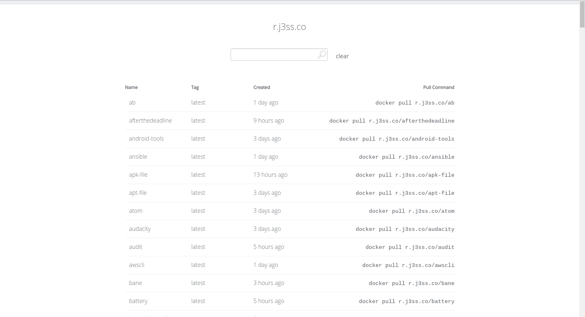
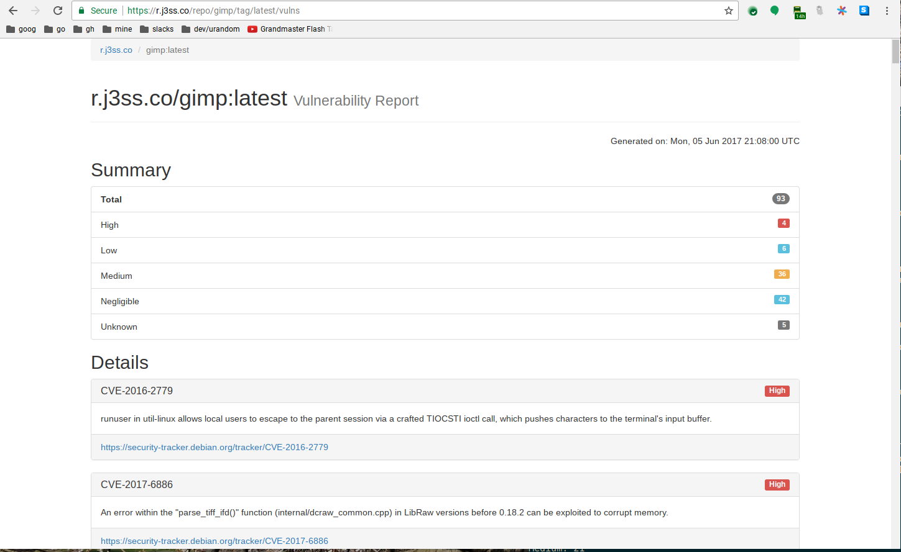

# reg

[](https://travis-ci.org/genuinetools/reg)
[](https://godoc.org/github.com/genuinetools/reg)
[](https://github.com/genuinetools/reg/releases)

Docker registry v2 command line client and repo listing generator with security checks.

 * [Installation](README.md#installation)
      * [Binaries](README.md#binaries)
      * [Via Go](README.md#via-go)
 * [Usage](README.md#usage)
   * [Auth](README.md#auth)
   * [List Repositories and Tags](README.md#list-repositories-and-tags)
   * [Get a Manifest](README.md#get-a-manifest)
   * [Get the Digest](README.md#get-the-digest)
   * [Download a Layer](README.md#download-a-layer)
   * [Delete an Image](README.md#delete-an-image)
   * [Vulnerability Reports](README.md#vulnerability-reports)
   * [Running a Static UI Server for a Registry](README.md#running-a-static-ui-server-for-a-registry)
   * [Using Self-Signed Certs with a Registry](README.md#using-self-signed-certs-with-a-registry)
 * [Contributing](README.md#contributing)

## Installation

#### Binaries

For installation instructions from binaries please visit the [Releases Page](https://github.com/genuinetools/reg/releases).

#### Via Go

```console
$ go get github.com/genuinetools/reg
```

## Usage

```console
$ reg -h
reg -  Docker registry v2 client.

Usage: reg <command>

Flags:

  -d                   enable debug logging (default: false)
  -f, --force-non-ssl  force allow use of non-ssl (default: false)
  -k, --insecure       do not verify tls certificates (default: false)
  -p, --password       password for the registry (default: <none>)
  --skip-ping          skip pinging the registry while establishing connection (default: false)
  --timeout            timeout for HTTP requests (default: 1m0s)
  -u, --username       username for the registry (default: <none>)

Commands:

  digest    Get the digest for a repository.
  layer     Download a layer for a repository.
  ls        List all repositories.
  manifest  Get the json manifest for a repository.
  rm        Delete a specific reference of a repository.
  server    Run a static UI server for a registry.
  tags      Get the tags for a repository.
  vulns     Get a vulnerability report for a repository from a CoreOS Clair server.
  version   Show the version information.
```

**NOTE:** Be aware that `reg ls` doesn't work with `hub.docker.com` as it has a different API than the [OSS Docker Registry](https://github.com/docker/distribution).

### Auth

`reg` will automatically try to parse your docker config credentials, but if
not present, you can pass through flags directly.

### List Repositories and Tags

**Repositories**

```console
# this command might take a while if you have hundreds of images like I do
$ reg ls r.j3ss.co
Repositories for r.j3ss.co
REPO                  TAGS
awscli                latest
beeswithmachineguns   latest
camlistore            latest
chrome                beta, latest, stable
...
```

**Tags**

```console
$ reg tags r.j3ss.co/tor-browser
alpha
hardened
latest
stable

# or for an offical image
$ reg tags debian
6
6.0
6.0.10
6.0.8
6.0.9
7
7-slim
7.10
7.11
7.11-slim
...
```

### Get a Manifest

```console
$ reg manifest r.j3ss.co/htop
{
   "schemaVersion": 1,
   "name": "htop",
   "tag": "latest",
   "architecture": "amd64",
   "fsLayers": [
     {
       "blobSum": "sha256:a3ed95caeb02ffe68cdd9fd84406680ae93d633cb16422d00e8a7c22955b46d4"
     },
     ....
   ],
   "history": [
     ....
   ]
 }
```

### Get the Digest
```console
$ reg digest r.j3ss.co/htop
sha256:791158756cc0f5b27ef8c5c546284568fc9b7f4cf1429fb736aff3ee2d2e340f
```

### Download a Layer

```console
$ reg layer -o r.j3ss.co/chrome@sha256:a3ed95caeb02ffe68cdd9fd84406680ae93d633cb16422d00e8a7c22955b46d4
OR
$ reg layer r.j3ss.co/chrome@sha256:a3ed95caeb0.. > layer.tar
```


### Delete an Image

```console
$ reg rm r.j3ss.co/chrome@sha256:a3ed95caeb02ffe68cdd9fd84406680ae93d633cb16422d00e8a7c22955b46d4
Deleted chrome@sha256:a3ed95caeb02ffe68cdd9fd84406680ae93d633cb16422d00e8a7c22955b46d4
```

### Vulnerability Reports

```console
$ reg vulns --clair https://clair.j3ss.co r.j3ss.co/chrome
Found 32 vulnerabilities
CVE-2015-5180: [Low]

https://security-tracker.debian.org/tracker/CVE-2015-5180
-----------------------------------------
CVE-2016-9401: [Low]
popd in bash might allow local users to bypass the restricted shell and cause a use-after-free via a crafted address.
https://security-tracker.debian.org/tracker/CVE-2016-9401
-----------------------------------------
CVE-2016-3189: [Low]
Use-after-free vulnerability in bzip2recover in bzip2 1.0.6 allows remote attackers to cause a denial of service (crash) via a crafted bzip2 file, related to block ends set to before the start of the block.
https://security-tracker.debian.org/tracker/CVE-2016-3189
-----------------------------------------
CVE-2011-3389: [Medium]
The SSL protocol, as used in certain configurations in Microsoft Windows and Microsoft Internet Explorer, Mozilla Firefox, Google Chrome, Opera, and other products, encrypts data by using CBC mode with chained initialization vectors, which allows man-in-the-middle attackers to obtain plaintext HTTP headers via a blockwise chosen-boundary attack (BCBA) on an HTTPS session, in conjunction with JavaScript code that uses (1) the HTML5 WebSocket API, (2) the Java URLConnection API, or (3) the Silverlight WebClient API, aka a "BEAST" attack.
https://security-tracker.debian.org/tracker/CVE-2011-3389
-----------------------------------------
CVE-2016-5318: [Medium]
Stack-based buffer overflow in the _TIFFVGetField function in libtiff 4.0.6 and earlier allows remote attackers to crash the application via a crafted tiff.
https://security-tracker.debian.org/tracker/CVE-2016-5318
-----------------------------------------
CVE-2016-9318: [Medium]
libxml2 2.9.4 and earlier, as used in XMLSec 1.2.23 and earlier and other products, does not offer a flag directly indicating that the current document may be read but other files may not be opened, which makes it easier for remote attackers to conduct XML External Entity (XXE) attacks via a crafted document.
https://security-tracker.debian.org/tracker/CVE-2016-9318
-----------------------------------------
CVE-2015-7554: [High]
The _TIFFVGetField function in tif_dir.c in libtiff 4.0.6 allows attackers to cause a denial of service (invalid memory write and crash) or possibly have unspecified other impact via crafted field data in an extension tag in a TIFF image.
https://security-tracker.debian.org/tracker/CVE-2015-7554
-----------------------------------------
Unknown: 2
Negligible: 23
Low: 3
Medium: 3
High: 1
```

### Generating Static Website for a Registry

`reg` bundles a HTTP server that periodically generates a static website
with a list of registry images and serves it to the web.

It will run vulnerability scanning if you
have a [CoreOS Clair](https://github.com/coreos/clair) server set up
and pass the url with the `--clair` flag.

It is possible to run `reg server` just as a one time static generator.
`--once` flag makes the `server` command exit after it builds the HTML listing.

There is a demo at [r.j3ss.co](https://r.j3ss.co).

**Usage:**

```console
$ reg server -h
Usage: reg server [OPTIONS]

Run a static UI server for a registry.

Flags:

  -u, --username       username for the registry (default: <none>)
  --listen-address     address to listen on (default: <none>)
  --asset-path         Path to assets and templates (default: <none>)
  -f, --force-non-ssl  force allow use of non-ssl (default: false)
  --once               generate the templates once and then exit (default: false)
  --skip-ping          skip pinging the registry while establishing connection (default: false)
  --timeout            timeout for HTTP requests (default: 1m0s)
  --cert               path to ssl cert (default: <none>)
  -d                   enable debug logging (default: false)
  --key                path to ssl key (default: <none>)
  --port               port for server to run on (default: 8080)
  -r, --registry       URL to the private registry (ex. r.j3ss.co) (default: <none>)
  --clair              url to clair instance (default: <none>)
  -k, --insecure       do not verify tls certificates (default: false)
  --interval           interval to generate new index.html's at (default: 1h0m0s)
  -p, --password       password for the registry (default: <none>)
```

**Screenshots:**





### Using Self-Signed Certs with a Registry

We do not allow users to pass all the custom certificate flags on commands
because it is unnecessarily messy and can be handled through Linux itself.
Which we believe is a better user experience than having to pass three
different flags just to communicate with a registry using self-signed or
private certificates.

Below are instructions on adding a self-signed or private certificate to your
trusted ca-certificates on Linux.

Make sure you have the package `ca-certificates` installed.

Copy the public half of your CA certificate (the one used to sign the CSR) into
the CA certificate directory (as root):

```console
$ cp cacert.pem /usr/share/ca-certificates
```

## Contributing

If you plan on contributing you should be able to run the tests locally. The
tests run for CI via docker-in-docker. But running locally with `go test`, you
need to make one modification to your docker daemon config so that you can talk
to the local registry for the tests.

Add the flag `--insecure-registry localhost:5000` to your docker daemon,
documented [here](https://docs.docker.com/registry/insecure/) for testing
against an insecure registry.

**OR** 

Run `make dind dtest` to avoid having to change your local docker config and
to run the tests as docker-in-docker.
